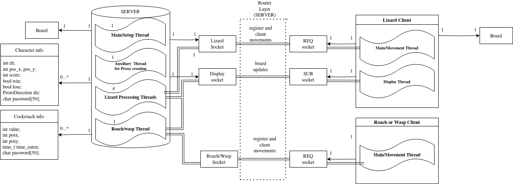

# Systems Programming Project Report

## Creators

Diogo Lee Leitão nº 99917 LEEC
João Barreiros C. Rodrigues nº99968 LEEC

## General Architecture

## Communication / Message Architecture
 
Two protobuffer messages:

- **ProtoCharMessage**
    - Used to play the game, contains information about the character(s) movement(s)

- **ProtoDisplayMessage**
    - Used to update remote displays in lizard clients 

One hardcoded C structure:

- **Board**
    - Since the lizards do not need to communicate exclusively in protobuffer Messages a C structure is sent hardcoded through the ZMQ-REP server socket after the lizard client regists its display in the server so that the lizard's display can be initialized with the current state of the game.
    - A containerized version of the struct could have been done in protobuffer, but we opted to not change this as it was not required.
    
## Implemented Functionalities 

### General/Meta

[x] Simple Message Authentication using passwords

### Server

[X] Threaded Server with 4 threads for Lizard Handling and 1 for Roach/Wasp Handling

[X] Include win and lose conditions

### Lizard-Client

[X] Seamesly integrate remote display

[X] Timeout Inactive Clients

[X] Handle SIGNINT exit

### Roach/Wasp client

[X] Handle SIGINT exit

[X] Create client in a non-C language

## Major alterations between versions
